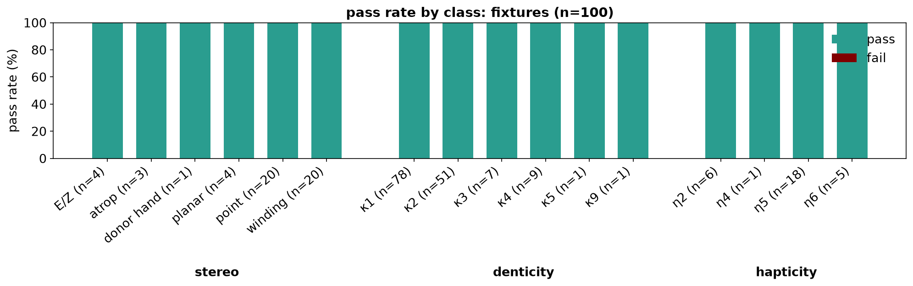
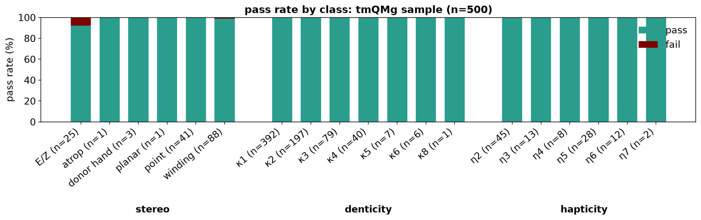

# rxembed: Constrained conformer embedding for reactive chemistry

rxembed generates 3D conformers around stated geometry: distances, angles, rigid transition-state cores,
coordination polyhedra and non-covalent contacts. It edits RDKit's distance bounds before embedding and holds
the constraints through a restrained UFF relaxation.

[](https://github.com/aligfellow/rxembed/LICENSE)
[](https://docs.astral.sh/uv)
[](https://github.com/astral-sh/ruff)
[](https://github.com/astral-sh/ty)
[](https://github.com/aligfellow/rxembed/actions)
[](https://codecov.io/gh/aligfellow/rxembed)

## Installation

rxembed is not yet on PyPI. Install it from a clone:

```bash
git clone https://github.com/aligfellow/rxembed.git
cd rxembed
pip install .                     # base: NumPy, RDKit and NetworkX
pip install '.[workflow]'         # recommended: adds XYZ perception, pruning, representatives and plots
pip install '.[search,workflow]'  # full: adds OpenConf Monte Carlo search
```

xTB scoring and optimization need the [xTB executable](https://github.com/grimme-lab/g-xtb) at `~/bin/xtb`, or
at the path in `$XTB_EXE`.

## Quick Start

```python
import rxembed as rx

ens = rx.embed("OCCCCO", n=20).minimize()
best = ens.lowest(3)
best.dump("best.xyz")  # three conformers in one multi-frame XYZ
```

`rx.embed` takes SMILES, an `.xyz` path, an RDKit `Mol` or a selected metal `Isomer` and always makes new
coordinates; `rx.minimize` relaxes existing ones. One molecule returns an `Ensemble`; a request with several
answers, such as every isomer of a metal complex, returns an `EnsembleSet`, a list of ensembles whose methods
apply to every member. The examples below run from the root of a clone. The [notebooks](examples/) go from
[the bounds matrix](examples/00_how_it_works.ipynb) to [transition-metal catalysts](examples/11_tm_catalysts.ipynb).

## Constraints and Rigid Cores

Every input shares the same `fix`, `constrain` and `template` arguments. Atom indices are 0-based;
`rx.match(mol, smarts)` resolves a unique SMARTS match or raises.

| constraint | call |
|---|---|
| a numeric distance, angle or dihedral | `fix={(i, j): 2.05, (i, j, k): 170.0, (i, j, k, l): 180.0}` |
| a soft numeric window | `constrain={(i, j): (2.0, 2.2), (i, j, k, l): (170.0, 190.0)}` |
| a rigid core | `fix=[i, j, k]`, `fix={i: (x, y, z)}`, or `template=(ref, SMARTS_or_map)` |
| a coordination polyhedron | `rx.metal(smiles, "octahedral")` |
| a stated NCI grip or π stack | `constrain={(ring_a, ring_b): 3.5}` |
| automatically proposed NCI contacts | `contacts="auto"` |

```python
ref = rx.embed("OCCCCO", n=1)
held = rx.embed(ref.mol, fix=[0, 1, 2], n=4)  # atoms 0-2 stay where ref has them
grafted = rx.embed("OCCCCCO", template=(ref, {0: 0, 1: 1, 2: 2}), n=4)  # copied onto another molecule

core = "[F].[#6]-[Cl]"  # an SN2 transition state onto a new substrate
ts = rx.read_xyz("examples/structures/sn2.xyz", charge=-1)
reaction = rx.embed("[F-].c1ccccc1CCl", template=(ts, core), n=4)
fluoride, carbon, chloride = rx.match(reaction.mol, core)
reaction.measure((fluoride, carbon))  # forming bond

pair = rx.embed("CC(=O)O.c1ccncc1", constrain={(3, 7): (2.6, 2.9)}, n=5)  # acid O-H...N of pyridine
```

A symmetric SMARTS, or a reference with coordinates only, needs an explicit `{target_index: reference_index}`
map. Dot-separated molecules embed in one frame with each free fragment kept beside the others. See
[constraints](examples/02_constraints.ipynb), [NCI modes](examples/03_nci.ipynb),
[transition states](examples/04_organic_ts.ipynb) and [retargeting a TS](examples/10_retarget_ts.ipynb).

## Metal Complexes

```python
isomers = rx.metal("CCCN->[Pd+2](<-[Cl-])(<-[Cl-])<-NCCC", "SPL")
isomers.summary()
trans = isomers.select(label="trans")
trans_confs = rx.embed(trans, n=10)
all_confs = rx.embed("CCCN->[Pd+2](<-[Cl-])(<-[Cl-])<-NCCC", metal="SPL", n=10)  # every isomer
```

`rx.metal` takes SMILES, an `.xyz` path or a `Mol` and returns every distinct arrangement as an `IsomerSet`.
Dative SMILES with charged anionic ligands, as above, is preferred and covalent SMILES is accepted. Write
hydrides, H₂ and bridging hydrogens explicitly. `.select()` returns the one isomer matching `label`, `hand`,
`index`, `stereo` or `center`, or raises; `.filter()` returns a subset. `screen=False` keeps arrangements the
ligands cannot reach, and `lengths="input"` measures metal-ligand distances instead of using the fitted model.

Geometries by coordination number, default first: 1 `MCO`; 2 `LIN`; 3 `TPL`, `TSH`, `TPY`; 4 `SPL`, `TET`, `SEE`;
5 `TBP`, `SPY`; 6 `OCT`, `TPR`, `HPL`; 7 `PBP`, `COC`, `CTP`; 8 `SQA`, `DOD`; 9 `TCT`; 10 `BSA`; 11 `ECI`. Codes
and full names (`octahedral`, `t_shape`) are case-insensitive, and an unknown name lists them all. Without a
geometry, rxembed classifies the input coordinates or takes the default. Each haptic face (a side-on bond, Cp,
an arene) is one site bound through its centroid; four sites with an η3 or larger face default to tetrahedral.

A `fix` on the coordination sphere decides which arrangements exist, so give it to `rx.metal`. A ligand core
away from the metal does not, so template it after selection. `coordinate=` binds a fragment's donor, as SMARTS
or an atom index, to an open vertex:

```python
mn = rx.read_xyz("examples/structures/mn-h2.xyz", charge=-1)
core = [1, 5, 63, 64, 65, 66]  # Mn, its amine N, and the H-H and N-H...O atoms of a reacting core
states = rx.metal(mn, "OCT", center="Mn", fix=core)
chosen = states.select(label="mer", hand="lambda", index=4)
mn_confs = rx.embed(chosen, n=4)

templated = rx.embed(trans, template=(trans_confs[0], {0: 0, 1: 1, 2: 2}), n=10)
bound = rx.embed(rx.metal("N->[Pt](Cl)Cl.CC(C)=O", "SPL").select(index=0), coordinate="[OX1]", n=10)
```

### Stereo

`stereo=` on `rx.embed` and `rx.metal` controls point R/S, E/Z, atropisomer M/P and bound-donor hands:

| `stereo=` | effect |
|---|---|
| omitted | a SMILES enumerates only its undefined stereo; a geometry keeps what it measures, except a diene's class |
| `"racemic"` | enumerate every configurable element, defined ones included |
| `"separate"` | `rx.embed` only: as omitted, but return a `list[EnsembleSet]`, one per configuration |
| `"free"` | no enumeration; the seed decides |
| `{"N5": "racemic"}` | set the mode of one atom, named by element and index |
| `{"locked": "racemic"}` | enumerate both hands of every coordination-locked donor, such as a bound amine N |

A dict can also key a mode (`"preserve"`, `"racemic"`, `"invert"`, `"free"`) by kind: `"point"`, `"ez"`,
`"axial"`, `"locked"` or `"default"`. A bound diene is s-cis or s-trans, each an isomer
([07_metal](examples/07_metal.ipynb)); s-trans binding is rare (10 of 358 open-chain η4 dienes in tmQMg), so
compare the classes with a real energy, or keep the measured one with `observed_only=True`.

```python
locked_hands = rx.metal("examples/structures/mnh.xyz", stereo={"locked": "racemic"})
```

### Shape check

An accepted conformer's sphere reads as the requested polyhedron within 0.01 of the best fit (0 is ideal); one
that slid into another shape is rejected. The reading is the conformer property `shape`:

```python
cid = trans_confs.ids[0]
print(trans_confs.mol.GetConformer(cid).GetProp("shape"))  # e.g. Pd4 SPL 0.070 (next SEE 0.322)
```

`rx.ligands(mol)` splits a complex into ligands. See [metals](examples/07_metal.ipynb),
[catalysts](examples/11_tm_catalysts.ipynb) and [dative SMILES](examples/12_dative_smiles.ipynb).

## XYZ Input

```python
mol = rx.read_xyz("examples/structures/mnh.xyz", charge=0, bond_orders="xyz2mol")
```

By default xyzgraph (the `workflow` extra) perceives bonds and bond orders. xyz2mol bond orders optimize
transition-metal valence; keep xyzgraph's for reactive or multicentre bonds such as a TS or a bridging hydride.
The alternatives `connectivity="rdkit"` and `"xyz2mol"` need xyz2mol bond orders. An XYZ stores no charge and
rxembed never infers one: pass the real charge for an ion (`rx.embed`, `rx.metal` and `rx.minimize` take
`charge=` too), or `metal_charges={0: 2, 1: 1}` for a split the total does not fix. `read_xyz` warns when a
metal looks like an ion read as neutral, and on every perception change, which never alters the atoms, their
order or the charge; `fallback=False` raises instead.

## Save Results

```python
print(rx.dative_smiles(mn_confs.mol))  # connectivity
print(rx.cxsmiles(chosen))  # also the selected metal arrangement; rx.embed reads it back directly
mn_confs.dump("mn.xyz")  # one multi-frame XYZ
paths = all_confs.dump("palladium.xyz")  # one file per isomer
```

Neither SMILES stores `fix` or `constrain`. `ens.mol` is a normal RDKit `Mol`, so RDKit's writers work too.

## Workflow Operations

```python
searched = rx.embed("OCCCCO").mc(preset="rapid").minimize().prune()
representatives = searched.representatives()
optimized = searched.score("gxtb").lowest(3).optimize("gfn2")
walk = rx.embed(trans, n=1, trajectory=True)  # walk.trajectory holds the seed and UFF snapshots
walk.dump_trajectory("cleanup.xyz")
```

- `mc()` needs the `search` extra; `prune()`, `representatives()` and `filter("connectivity")` need `workflow`.
- `minimize()` is restrained UFF. When UFF cannot type the real graph it relaxes a stand-in and marks the
  result `energy_kind="uff-surrogate"`; `score("ff")` is an exact single point and raises instead.
- `check()` reports geometry problems per conformer and `filter("geometry")` drops them.
- `score()` also takes a caller-supplied ASE calculator, such as `rx.ASE(XTB())` from
  [xtb_ase](https://github.com/Quantum-Accelerators/xtb_ase). See [energies](examples/08_energies.ipynb).

## Embedding Settings

`n`, `seed` and `threads` go to `rx.embed`; everything else about seeding is one `rx.EmbedParams`. The default
model is RDKit's `KDG()` with all-in-one refinement; pass another as `native`:

```python
from rdkit.Chem import rdDistGeom

ens = rx.embed("C1CCCCC1O", n=3, params=rx.EmbedParams(seed=42, native=rdDistGeom.srETKDGv3()))
again = rx.embed("C1CCCCC1O", n=3, params=ens.params)  # the same conformers
```

Set `seed`, `threads` and `prune_rms` on `EmbedParams`, not the native object, and geometry through `fix` and
`constrain`. The switches `coplanar_14`, `metal_floor_relief`, `donor_orientation` and `conjugation` each remove
one of rxembed's additions, for study ([07_metal](examples/07_metal.ipynb)). `max_iters` caps the UFF relax.

## Errors and How It Works

Distance geometry seeds each conformer from RDKit's bounds matrix with the stated geometry written in
([00_how_it_works](examples/00_how_it_works.ipynb)). Restrained UFF cleans each seed, and a gate checks bonds,
clashes, the polyhedron, hands, stereocentres and `fix` values, retrying with stiffer restraints and then fresh
seeds. The metal is a stand-in atom during both; the real metal and its charge are restored before any check.

A single request that cannot be built raises `EmbeddingError`: one sentence naming the isomer, the most common
reason and a remedy, with every rejected seed counted in `err.failures`. A request that expands into several
candidates returns what embedded, lists the rest in `result.errors`, and raises only when none embeds. A
warning means the result differs from the request. `rx.set_verbose("DEBUG")` shows every retry.

`rxembed.core` is the low-level API for an explicit-H RDKit `Mol`, such as
`core.embed(mol, constrain={(0, 5): (2.6, 3.0)}, n=8)`. [ARCHITECTURE.md](ARCHITECTURE.md) maps the modules.

## Limitations

- Rigid conjugated macrocycles, such as porphyrins, can embed in unlikely folded seatings that pass the gate.
- A relaxation can make or break a bond that the gate does not re-read; use `filter("connectivity")`.
- XYZ charges come from a Lewis-structure perception and can disagree with a published oxidation state.
  `read_xyz` can keep a chelate-diagonal bond, as in LAPQIC's κ2-C,C ring.
- More than 1,000 distinct arrangements are refused (SORGAK's La podand); use `observed_only=True`,
  `rx.embed(mol)` without `metal=`, or `rx.metal(rx.cxsmiles(mol))`.
- `rx.metal` does not enumerate a haptic ligand's rotation about the metal-centroid axis; `mc()` keeps each pose.
- A ring bound through some of its atoms (an η4-arene) folds about 10° past its crystal fold.
- `mc()` holds poses softly, with about 0.1 Å drift; state a constraint that must hold as a number.
- g-xTB with solvent is `E_gxtb(gas) + [E_gfn2(solv) - E_gfn2(gas)]`.

## Development

```bash
just setup  # uv sync and pre-commit
just check  # format, lint, types and tests; just test runs the tests alone
```

`uv sync` is the full development install and `uv sync --no-default-groups` the base tier. Tests that need a
[tmQMg](https://github.com/hkneiding/tmQMg) clone skip unless `RXEMBED_TMQMG_DIR` points at its `data/`
directory. The metal round-trip benchmark is in [benchmark/README.md](benchmark/README.md);
[ARCHITECTURE.md](ARCHITECTURE.md) gives the package structure and [AGENTS.md](AGENTS.md) the development rules.

## License

[MIT](LICENSE). Vendored components retain their upstream notices in [LICENSES.md](LICENSES.md).

## References

- [RDKit](https://github.com/rdkit/rdkit): embedding, ETKDG, UFF
- [openconf](https://github.com/rowansci/openconf): Monte Carlo conformational sampling
- [prism_pruner](https://pypi.org/project/prism-pruner/): conformer pruning
- [xyzgraph](https://github.com/aligfellow/xyzgraph): `.xyz` metal and TS perception
- [xyz2mol_tm](https://github.com/jensengroup/xyz2mol_tm): vendored, the alternative bond-order perceiver
- [xtb](https://github.com/grimme-lab/g-xtb): GFN-FF, GFN2-xTB and g-xTB
- [tmQMg](https://github.com/hkneiding/tmQMg): tmQMg dataset

Related projects:

- [MetalloGen](https://github.com/kyunghoonlee777/MetalloGen): automated transition metal complex conformer generation
- [Molassembler](https://github.com/qcscine/molassembler): molecular graphs, coordination stereochemistry and conformer generation
- [racerTS](https://github.com/digital-chemistry-laboratory/racerts): efficient conformer sampling for transition states
- [OIN-SMILES](https://github.com/tjmustard/OIN-SMILES): lossless conversion between 3D XYZ structures and 1D SMILES

## Metal performance

Each structure is read from its XYZ, written as a CX SMILES, and embedded fresh from that CX string; it
passes when the embedded CX matches. `just bench` runs the 100 shipped fixtures, `just bench tmqmg
--size N` a diverse tmQMg sample.




[benchmark/README.md](benchmark/README.md) has timings, per-metal breakdowns, core RMSD and the sample's
coverage of tmQMg.
