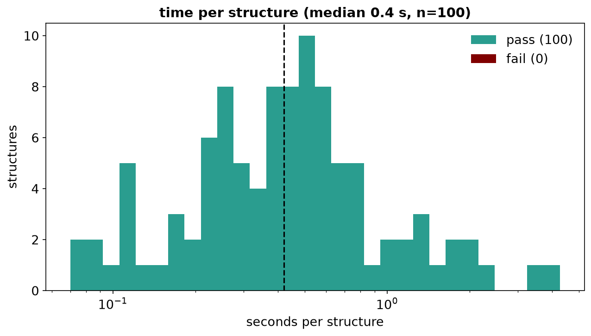
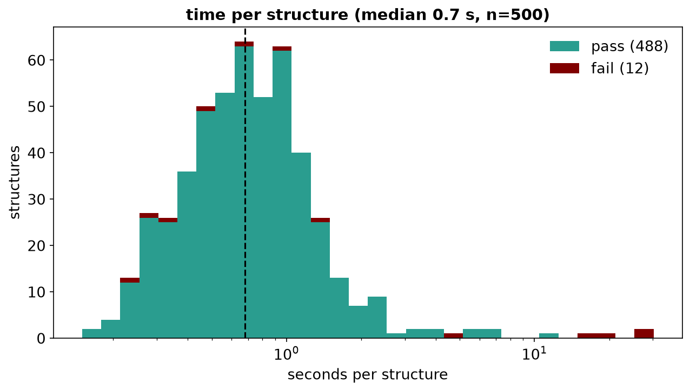
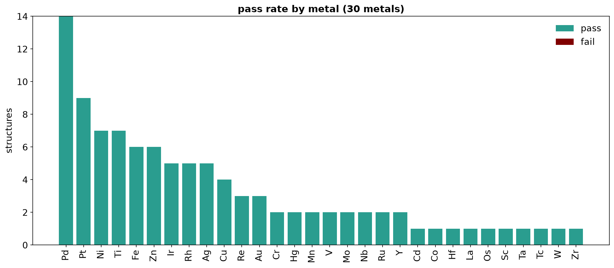
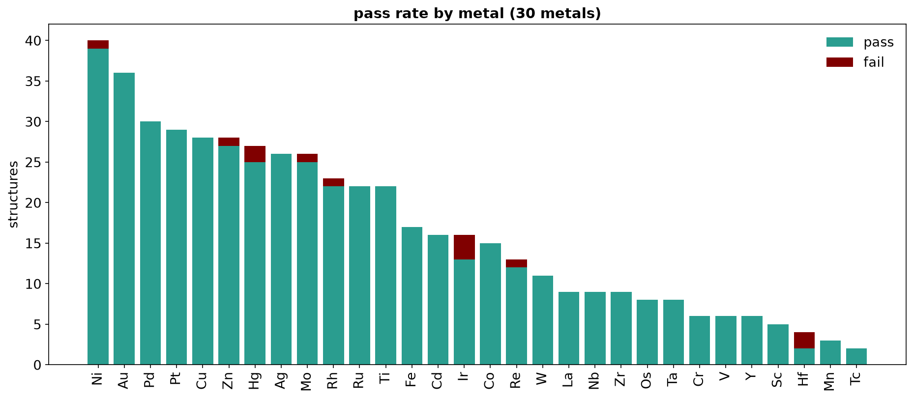
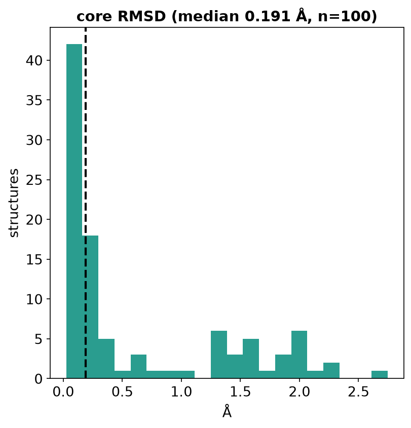
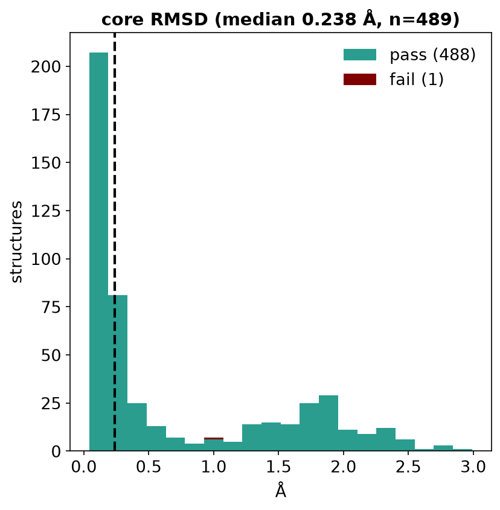
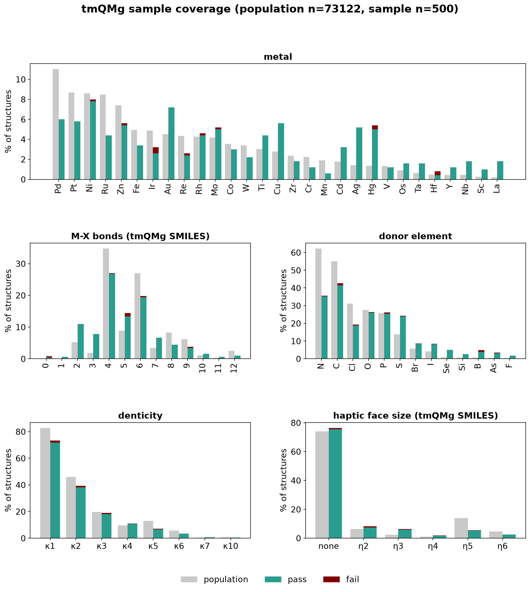

# Metal round-trip benchmark

Read each structure's XYZ, write it as a CX SMILES, and embed that CX string fresh; it passes when the
freshly embedded structure's own CX matches the input's. Each results CSV row also carries timing, core
RMSD, the metal, and kappa/eta denticity; see `run.py`'s `FIELDS` for the exact columns.

## Commands

```sh
just bench                   # the 100 shipped fixtures, compared against baseline.csv
just bench tmqmg --size N    # a MaxMin-diverse sample of a local tmQMg clone (RXEMBED_TMQMG_DIR)
just bench-plot              # regenerate benchmark/docs/*.png from a results CSV
```

To accept a measured change, copy the new results CSV over `benchmark/baseline.csv`.

## tmQMg sample

`_in_scope` keeps a row only when its SMILES parses and it carries no carborane-like cage (>=5 B, any
C). The sample itself is RDKit's MaxMin diversity picker over a metal/donor/ligand fingerprint, at a
fixed seed, seeded by one typical structure per metal; it never selects on pass/fail.

## Figures

Each pair is the fixtures result then the tmQMg sample:

Every figure stacks fail (maroon) on top of pass (teal); fail covers a failure at any stage, and a
timeout.

 
Seconds per structure.

 
Counts per metal.

 
Metal-core RMSD between the input and the fresh embed.

 
Pass rate by stereo kind, denticity (kappa) and hapticity (eta) class.


The sample's fingerprint coverage against the full in-scope tmQMg population (grey, counts only); the
sample bar beside it stacks fail on pass by the same category.

## Fixtures and licences

`fixtures.csv` + `fixtures/*.xyz` are the local, tracked cohort:

| origin | fixtures | source | licence |
|---|---|---|---|
| tmQMg | 65 | github.com/hkneiding/tmQMg | MIT, (c) 2024 Hannes Kneiding |
| OIN | 34 | github.com/tjmustard/OIN-SMILES | MIT, (c) 2025 Thomas J. L. Mustard |
