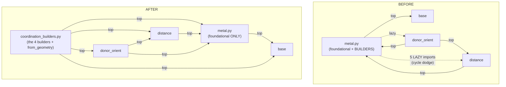

# Design: move the coordination BUILDERS out of foundational `metal.py`

Read-only design study. Target: `src/rxembed/rdkit_embed/constraints/metal.py` (1228 lines) on branch
`rdkit-embed-kernel`. **Question:** does extracting the coordination-constraint *builders* into their own
consumer-layer module genuinely clean the import graph + discoverability, or is it relocation / the start of
fragmentation?

**Verdict (short):** Real improvement, and a *clean single seam*. The builders already sit logically at the
**top** of the `metal → distance → donor_orient` stack while physically living at its **bottom** (inside
`metal.py`); that inversion is exactly what forces the 5 lazy in-function imports. Extracting them removes all
5, leaves `metal.py` with **zero** references to `distance`/`donor_orient`, and forms no new back-edge. It is
one extraction (not the rejected 7-way split), it completes a carve the maintainer already started
(`distance.py` was carved *down* out of `metal.py`; the builders are the piece left *up top*), and the kernel
test harness explicitly budgets for it (`_KERNEL` is a one-line add). Proposed name:
**`constraints/coordination_builders.py`**.

---

## 1. What is in `metal.py` today — foundational vs builder

### Foundational (STAYS) — surrogate machinery, polyhedron tables, geometry primitives

Imports only `numpy`, `rdkit`, `rdkit_embed.io`, `. import polyhedron`, `.base`. Depends on **nothing** in
`distance`/`donor_orient`.

- **Tables / constants (the hub):** `TRANSITION_METALS`, `_METAL_Z`, `SURROGATE`/`FF_SURROGATE`/`UFF_GHOST`,
  `GEOM_OPTIONS`, `ANGLES`, `PERMUTATIONS`, `VERTEX_DIRS`, `VACANT`, `COPLANAR_GEOMETRIES`,
  `_NO_GEOMETRIC_ISOMERISM`, `_SPAN_ANGLE`/`_SPAN_TOL`, `_APICAL_MIN`, `_TRANS_ANGLE`, `_DISCONNECTED` (the last
  is also imported by `mechanisms.py`).
- **Surrogate prepare/restore:** `surrogate_metal`, `restore_metal`, `surrogate_all_metals`, `connect_metal`,
  `disconnect_metal`, `metal_index`, `metal_indices`.
- **Haptic / phantom transient machinery:** `_haptic_sites`, `_regular_face`, `_collapse_haptic`,
  `materialise_phantoms`, `strip_phantoms`, `_site_radius`, `_shift_phantoms`.
- **Donor-chirality holds:** `_clear_labile_donor_stereo`, `_labile_donors`, `donor_chirality_sign`,
  `_hold_donor_chirality`, `_release_donor_chirality`.
- **Geometry naming / primitives:** `classify_geometry`, `_angle_spectrum`, `geometry_for`, `coplanar`,
  `n_sites`, `_vertex_angle`, `_frag_map`, `_vertex_atom`, `hold_shape`.
- **Isomer identity:** `Isomer` (dataclass + `restore()`), `label`, `arrangement`/`arrange`, `_donor_classes`,
  `_chelate_edges`, `chirality_of`, `lone_pair_donors`.

### Builders (MOVE) — consume `distance`/`donor_orient`, produce a `Constraints`

These are the *only* functions in the file that reach into `distance`/`donor_orient`, and they are the whole
reason for the lazy imports:

| Function | Line | Consumes (lazily) | Produces |
|---|---|---|---|
| `_centroid_constraints` | 809 | `distance.ml_distance` | fills `Constraints` (haptic vertex) |
| `coordination` | 846 | `distance.{delocalised_charges, ff_terms, ml_distance}`, `donor_orient.{_orient_donor, _coplanar_donor}` | a `Constraints` (ideal polyhedron) |
| `_chelate_bite_window` (+ `_CHELATE_BITE`, l.927) | 933 | — (builder-only helper of `coordination`) | a bite window |
| `coordination_from_geometry` | 963 | `distance.ff_terms` | a `Constraints` (as-given arrangement) |
| `from_geometry` | 994 | calls `coordination_from_geometry` (+ foundational) | an `Isomer` |
| `coordinate` | 1182 | `distance.{_FLOOR_REACH, _tier_floor, overbond_tier}` | a `Constraints` (seat into vacancies) |

`from_geometry` is not itself a distance/donor_orient consumer, but it is the **only** in-`metal` caller of a
builder (`coordination_from_geometry`); it moves with them so `metal.py` is left with no builder reference.

### The 5 lazy in-function imports (each dodging the cycle)

```
l.820  _centroid_constraints:        from .distance import ml_distance
l.861  coordination:                 from .distance import delocalised_charges, ff_terms, ml_distance
l.862  coordination:                 from .donor_orient import _coplanar_donor, _orient_donor
l.974  coordination_from_geometry:   from .distance import ff_terms
l.1195 coordinate:                   from .distance import _FLOOR_REACH, _tier_floor, overbond_tier
```

Each comment on these lines already documents the reason ("*lazy: distance imports this module's foundational
constants*"). They are deferred to call time so that all three modules are fully loaded by the time any builder
runs — a hand-maintained cycle dodge, and a readability smell (a module's real dependencies hidden mid-body).

---

## 2. The import cycle, mapped precisely

Top-level edges among the three modules today:

```
distance.py      l.14  from .metal import TRANSITION_METALS, VACANT          # distance  → metal (constants)
donor_orient.py  l.15  from .distance import _APEX_DONORS, APEX, overbond_tier  # donor_orient → distance
donor_orient.py  l.16  from .metal import _METAL_Z                           # donor_orient → metal (constant)
metal.py         (builders, lazy)  from .distance / .donor_orient import ... # metal(builders) → distance/donor_orient
```

So the *foundational* half of `metal.py` is a **dependency** of `distance` and `donor_orient`, while the
*builder* half of the same file is a **consumer** of them. That is a diamond collapsed into one file:

```
        metal (foundational constants)
           ▲            ▲
           │            │
       distance ──────► (metal constants)
           ▲     
           │            
      donor_orient ────► (metal + distance)
           ▲
           │   ...if the builders imported these at TOP LEVEL while staying in metal.py:
   metal (builders)  →  distance  →  metal      ✗ cycle
   metal (builders)  →  donor_orient → distance → metal   ✗ cycle
   metal (builders)  →  donor_orient → metal     ✗ cycle
```

A top-level `from .distance import ...` at the head of `metal.py` makes Python import `distance` while
`metal` is still initialising — and `distance` line 14 immediately asks `metal` for `TRANSITION_METALS`, which
does not exist yet. `ImportError` / partially-initialised module. The lazy imports are the only way to keep the
builders in `metal.py`.

---

## 3. The move

### Consumer-layer home — a NEW module, `constraints/coordination_builders.py`

There is **no** `constraints/coordination.py` to reuse. A `coordination.py` *does* exist, but it is the kernel
**gate** module at `rdkit_embed/coordination.py` (metal-sphere perception, `donor_orientation`/`donor_fold`) —
the *QA* side, not a builder. Naming the new module `constraints/coordination.py` would put a second
"coordination" module one package away from the gate and is a discoverability trap. Recommended name
**`coordination_builders.py`**, which parallels the existing `constraints/builders.py` (the generic
`fix`/`constrain`/`template` resolver `resolve_core`): the pair then reads as *"builders.py = index-driven
constraint sources; coordination_builders.py = the metal-polytope constraint sources."* (Runner-up: `spheres.py`
— ties to `SphereRecipe`/`from_geometry`; rejected only because `sphere.py` singular already exists and the two
would be confusable.)

### What moves / what stays

- **Moves** into `coordination_builders.py`: `_centroid_constraints`, `coordination`, `_chelate_bite_window`
  (+ `_CHELATE_BITE`, a builder-only constant), `coordination_from_geometry`, `from_geometry`, `coordinate`.
  All 5 lazy imports become **top-level** `from .distance import ...` / `from .donor_orient import ...`.
- **Stays** foundational in `metal.py`: everything in §1's foundational list. The new module imports what it
  needs from `metal` at top level (`VACANT`, `ANGLES`, `Isomer`, `_frag_map`, `_vertex_atom`, `_vertex_angle`,
  `_site_radius`, `_regular_face`, `_SPAN_ANGLE`, `classify_geometry`, `geometry_for`, `_APICAL_MIN`,
  `surrogate_metal`, `_collapse_haptic`, `strip_phantoms`, `label`, `chirality_of`, `_PT`) and from `base`
  (`Constraints`, `add_distance`, `SphereRecipe`).

`Isomer` (dataclass) stays in `metal` — `isomers.py` imports it, and its only method `restore()` calls
`restore_metal`, a foundational primitive. `from_geometry` (its factory) moving to the builder module is the
one minor split (constructor apart from dataclass); acceptable, and it keeps `metal.py` builder-free.

### Import graph — BEFORE vs AFTER



**AFTER is a strict DAG**, all edges top-level, all pointing down:
`base ← metal ← distance ← donor_orient ← coordination_builders`. Zero lazy imports. `metal.py` no longer
mentions `distance` or `donor_orient` at all.

### The cycle is genuinely broken — and there is precedent it works

- No back-edge: nothing in `metal`, `distance`, or `donor_orient` calls a builder. The only in-`metal`
  builder-caller (`from_geometry`) moves too. So `coordination_builders` is a pure *leaf consumer* — nothing
  below it imports it.
- **`solver.py` already proves the pattern.** It imports **both** `.metal` (`VACANT, VERTEX_DIRS, _frag_map,
  _site_radius`) **and** `.distance` (`ml_distance, delocalised_charges`) at **top level**, passes import
  hygiene, and is itself imported only by `embed/bounds.py` (a leaf). `coordination_builders` sits at the same
  layer as `solver` and follows the same rule.
- **`distance.py` is the other half of this exact carve, already done.** Its docstring: *"Carved out of
  `constraints.metal`; imports only its foundational constants."* The maintainer split the *leaf* (`distance`)
  down out of `metal`; the builders are the *top* of the same stack still stuck inside `metal`. This move
  finishes that carve rather than opening a new one.

---

## 4. Discoverability — "where are coordination constraints built?"

**BEFORE:** grep `coordination` → land in a 1228-line `metal.py` that mixes surrogate prepare/restore,
polyhedron tables, haptic/phantom transients, donor-chirality holds, geometry classification, isomer identity,
**and** the builders. The builder is at line 846; its real dependencies are hidden in function bodies at lines
820/861/862/974/1195. A new maintainer cannot see, from the file head, that "building coordination constraints"
even depends on `distance`/`donor_orient`.

**AFTER:** grep `coordination` → `coordination_builders.py`, a focused module whose top-level imports *are* the
dependency story (`from .distance import ...`, `from .donor_orient import ...`), sitting beside the generic
`builders.py`. `metal.py` becomes legibly "the metal foundation": surrogate, tables, primitives — one job.
`isomers.py` (the enumerator, the natural entry point) will `from ...coordination_builders import coordination`
explicitly, pointing the reader straight at the home. **More discoverable, both directions.**

---

## 5. Honest assessment

**Real improvement, not relocation.** The 5 lazy imports are deleted (not moved) — they only exist to dodge the
cycle, and the cycle only exists because consumer and dependency share a file. Moving the consumer out removes
the *cause*, so the fix is structural, not cosmetic. `metal.py` gains a real invariant it lacks today: it
imports nothing from `distance`/`donor_orient`, so it cannot regrow a lazy dodge.

**New-cycle risk: none.** Verified no foundational/`distance`/`donor_orient` code calls a builder; the new
module is a leaf. The `solver.py` precedent is the live proof that a module importing both `metal` and
`distance` top-level is cycle-free.

**Confusing-split risk: low, one caveat.** `coordination()` leaving `metal.py` while the polyhedron tables it
reads (`ANGLES`, `VERTEX_DIRS`) stay is the one thing a reader must absorb — but that is the *correct* layering
(tables are data the foundation owns; the builder is logic that consumes them), and it is already how `solver`,
`sphere`, and `donor_orient` relate to `metal`. Two shared primitives cross the seam (`_vertex_angle`, used by
both `label` and `coordination_from_geometry`; `Isomer`, constructed by the relocated `from_geometry`) — both
resolve as clean one-directional `builder → metal` imports, no duplication.

**Blast radius: small and mechanical (import-line level).** External callers of the builders are only:

- `isomers.py` — move `coordination` out of its big `from ...metal import (...)` block into
  `from ...coordination_builders import coordination` (keeps all foundational names from `metal`).
- `embed/dispatch.py` — `_metal.coordinate(...)` (l.307) and `_metal.from_geometry(...)` (l.689) → a
  `coordination_builders` alias; +1 import line.
- `tests/test_haptic.py` — 2 `_metal.from_geometry(...)` calls (l.180, l.213) → alias update. (The other
  `coord` tests import the **gate** `rdkit_embed.coordination`, unaffected.)
- `tests/test_import_hygiene.py` — **one line**: add `"constraints.coordination_builders"` to `_KERNEL`. The
  harness is designed for this ("*adding a new kernel module is a one-line addition to `_KERNEL`*").

No behaviour change, no constraint-math change: pure code relocation + import rewiring.

**One clean seam, or fragmentation?** One clean seam. The maintainer rejected a **7-way** split of `metal.py`;
this is a **single** extraction along the one seam the code itself already draws (the foundational/builder line
that the 5 lazy imports trace exactly). It is the same carve `distance.py` already made, in the same direction,
with explicit test-infra support. It does not invite a second cut: after it, `metal.py` is a coherent
foundation and `coordination_builders.py` is a coherent consumer, each with one job.

**Recommendation:** proceed, name it `constraints/coordination_builders.py`. Move the 4 builders +
`from_geometry` + `_chelate_bite_window`/`_CHELATE_BITE`; promote all 5 lazy imports to top level; rewire
`isomers.py`, `dispatch.py`, `test_haptic.py`, and add the one `_KERNEL` line. Keep `Isomer` and all tables /
primitives in `metal.py`.
